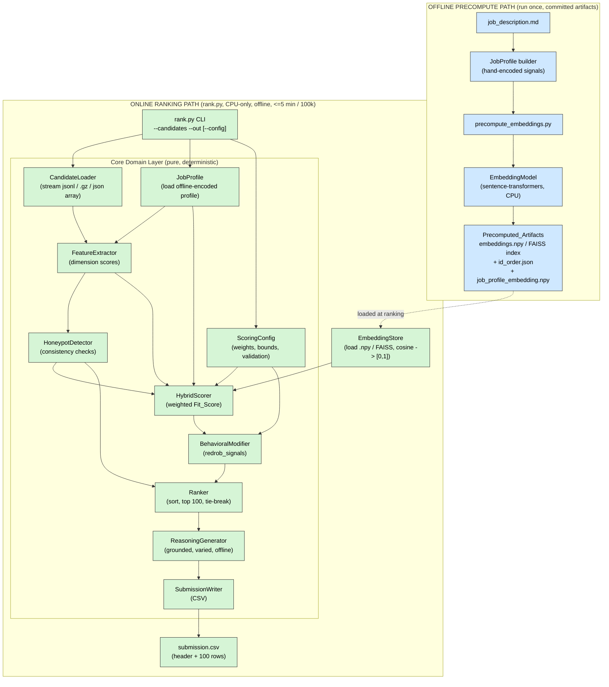

# Design Document

## Overview

The AI Candidate Ranking system is a **fully local, CPU-only, offline** Python application built for the Redrob Intelligent Candidate Discovery & Ranking Challenge. It reads up to 100,000 candidate profiles and a single fixed job description (Senior AI Engineer — Founding Team at Redrob AI), reasons about *genuine* fit, and writes a ranked top-100 CSV submission with grounded natural-language reasoning per candidate.

### Genuine-Fit Philosophy

The challenge is explicitly designed to punish naive keyword matching. The provided `sample_submission.csv` is an anti-pattern that ranks keyword-stuffers (e.g. an "HR Manager with 9 AI core skills") at the top. The scoring metric — NDCG@10 (0.50), NDCG@50 (0.30), MAP (0.15), Precision@10 (0.05) — places more than two thirds of its weight on the top 10 and top 50 positions, so the ordering of the strongest candidates dominates the final score.

To win on that metric the system reasons about the gap between what the job description *says* and what the role *needs*: production embeddings/retrieval/ranking experience at product companies, strong Python, and evaluation-framework experience (NDCG/MRR/MAP). It rewards strong-but-unbuzzwordy engineers, down-weights keyword stuffers and negative-signal profiles, folds in behavioral availability signals, and detects internally-inconsistent "honeypot" profiles so they never reach the top 100 (10% or more honeypots in the top 100 causes disqualification).

### Why Local Embeddings + Feature Hybrid + Honeypot Checks Beat Embedding-Only Ranking

A pure embedding-similarity ranker fails this challenge in three ways, each of which a hybrid design corrects:

1. **Embedding-only ranking rewards keyword stuffers.** A profile padded with "embeddings, retrieval, ranking, NDCG, FAISS, RAG" produces a candidate text that is *semantically very close* to the job description even though the person has never shipped any of it. Cosine similarity cannot tell aspiration from experience. The **title-aware feature layer** fixes this by weighting `current_title` and `career_history` titles above the raw count of listed skills, and by applying an **anti-keyword-stuffing trust multiplier** (endorsements + skill `duration_months` + proficiency).
2. **Embedding-only ranking is blind to internal inconsistency.** Honeypots with impossible date math or "expert / 0 months" skills embed just like real profiles. The **honeypot detector** uses structured consistency checks to flag and exclude them — directly protecting against the disqualification rule.
3. **Embedding-only ranking ignores availability and trajectory.** Two semantically identical profiles differ in notice period, recent activity, product-vs-services background, and job-hopping. The **structured feature dimensions** and the **behavioral modifier** separate them, which is exactly the kind of fine-grained ordering NDCG@10 rewards.

The hybrid combines the recall of semantic similarity (it surfaces genuinely relevant unbuzzwordy candidates) with the precision of explicit feature logic (it demotes traps), which is what moves NDCG and MAP on a ground truth built around genuine fit.

### Local / Offline / CPU Constraint

During the ranking command there is **no network access of any kind** — no hosted LLM or embedding APIs (OpenAI, Anthropic, Cohere, Gemini, Bedrock) and no other external calls. All intelligence comes from:

- A locally-hosted sentence-transformers embedding model (e.g. `BAAI/bge-small-en-v1.5` or `intfloat/e5-small-v2`) running on CPU with weights cached on disk.
- Structured, deterministic feature logic and a hand-encoded `Job_Profile`.
- A locally-stored vector index (FAISS flat or a numpy matrix).

The ranking step (`rank.py`) must complete within **5 minutes wall-clock for 100,000 candidates**, using **CPU only**, at most **16 GB RAM**, at most **5 GB intermediate disk**, and **zero network** (Requirement 10).

### Precompute-vs-Rank Split

Embedding 100,000 candidate texts on CPU is far too slow to fit inside a 5-minute ranking budget. The system therefore splits work into two paths:

- **Offline precompute path** (`precompute_embeddings.py`): runs once, embeds every candidate text and the job profile with the local model on CPU, and writes a committed `embeddings.npy` (plus a candidate-id order file and/or a FAISS index). This is reproducible from a documented script and uses only local models (Requirement 11).
- **Online ranking path** (`rank.py`): loads the precomputed embeddings from local disk, streams the candidate file, computes feature/honeypot/behavioral scores, ranks, generates reasoning, and writes the CSV — all without re-embedding and without network (Requirements 1, 3–10).

If candidates appear at ranking time without a precomputed embedding (e.g. the small sample path), the system embeds those *on the fly* on CPU; for the 100K full run the precomputed artifact is expected and a missing artifact is a hard error with build instructions (Requirement 11.5).

### Key Design Principles

1. **Pure logic separated from I/O.** Feature extraction, scoring, normalization, honeypot detection, ranking, reasoning, and config validation are pure deterministic functions. File parsing, model loading, and embedding live behind thin wrappers. This makes the core property-testable and the ranking reproducible (Requirements 3.6, 7.5).
2. **Streaming ingestion.** The candidate file is parsed line-by-line so peak memory stays bounded for 100K records (Requirement 10.3).
3. **Determinism.** Identical input + identical `ScoringConfig` produce byte-identical output via stable sorting and fixed tie-breaks (Requirements 3.6, 7.5).
4. **Graceful degradation.** Malformed rows are skipped with warnings; missing optional fields produce neutral contributions; the run does not crash on bad data (Requirement 1.5).
5. **Bounded scores.** Every dimension is normalized to [0,1], the behavioral modifier is bounded, and the final score stays in [0,1] so the CSV `score` column is well-formed.

## Architecture

The system has an offline precompute path and an online ranking path. The ranking path is organized into a CLI/orchestration layer, a pure core domain layer, and a thin local-IO/model layer. No layer makes network calls during ranking.



### Online Ranking Data Flow

1. **Ingest** — `CandidateLoader` streams `candidates.jsonl` (or `.jsonl.gz`, or a `sample_candidates.json` array), parsing each record, skipping malformed rows with a warning (line number + reason), and erroring on an unreadable file or zero valid records (Requirement 1).
2. **Job profile** — `JobProfile` is loaded from the offline hand-encoded representation of `job_description.md`; its precomputed embedding is loaded by `EmbeddingStore` (Requirement 2).
3. **Embedding similarity** — `EmbeddingStore` loads precomputed candidate embeddings, computes cosine similarity to the job embedding, and maps it to [0,1] (Requirements 3.2, 11.1).
4. **Feature extraction** — `FeatureExtractor` computes structured dimension scores (skills/title alignment with trust multiplier, experience fit, career trajectory / product-vs-services, education) (Requirements 3, 4).
5. **Honeypot detection** — `HoneypotDetector` runs consistency checks and flags impossible profiles (Requirement 6).
6. **Hybrid scoring** — `HybridScorer` combines semantic similarity and feature dimensions into a `Fit_Score` using `ScoringConfig` weights (Requirement 3).
7. **Behavioral modifier** — `BehavioralModifier` derives a bounded multiplier from `redrob_signals` and applies it to produce the `Final_Score`; honeypot penalty is applied so flagged records sink (Requirements 5, 6.4).
8. **Rank** — `Ranker` sorts by `Final_Score` descending, breaks ties by `candidate_id` ascending, and takes the top 100 with unique ranks 1..100 (Requirement 7).
9. **Reasoning** — `ReasoningGenerator` produces a grounded, varied 1–2 sentence justification per ranked candidate, fully offline and deterministic (Requirement 8).
10. **Output** — `SubmissionWriter` writes the UTF-8 CSV with the exact header and 100 rows, failing with a clear error if the path is unwritable (Requirement 9).

## Components and Interfaces

Interfaces are shown as illustrative Python signatures. The core layer is pure and deterministic; only `CandidateLoader`, `EmbeddingStore`, `EmbeddingModel`, and `SubmissionWriter` touch I/O, and none touch the network during ranking.

### CandidateLoader (core / streaming I/O)

```python
class CandidateLoader:
    def __init__(self, id_pattern: str = r"^CAND_[0-9]{7}$"): ...

    def load(self, path: str) -> "LoadResult":
        """Stream-parse candidates from .jsonl, .jsonl.gz, or a .json array.
        Skips malformed rows (warning with line number + reason), continues.
        Raises DatasetAccessError if the file is unreadable (Req 1.6),
        NoValidCandidatesError if zero valid records remain (Req 1.7)."""

    def iter_records(self, path: str) -> "Iterator[CandidateRecord]":
        """Lazy streaming iterator used for the 100K path (bounded memory)."""
```

Format is detected by extension: `.gz` → gzip text stream; `.json` → array load; otherwise JSON Lines. Each record is validated for parseability and a `candidate_id` matching `^CAND_[0-9]{7}$`; failures are skipped with a structured `SkipWarning(line_number, reason)` (Requirement 1.5). **Validates: Requirements 1.1–1.7.**

### JobProfile (core, offline-encoded)

```python
@dataclass(frozen=True)
class JobProfile:
    positive_signals: "PositiveSignals"
    negative_signals: "NegativeSignals"
    location_pref: "LocationPref"
    notice_pref: "NoticePref"
    profile_text: str          # canonical text embedded offline

    @classmethod
    def load(cls, path: str = "job_profile.yaml") -> "JobProfile":
        """Load the hand-encoded profile derived offline from job_description.md.
        No network access (Req 2.1, 2.5)."""
```

The profile is hand-encoded once from `job_description.md` and committed. It captures positive signals (production retrieval/ranking/embeddings at product companies, strong Python, NDCG/MRR/MAP eval frameworks), negative signals (keyword-stuffer titles, pure research without production, <12mo LangChain-only AI, not coding 18mo+, ~1.5yr title-chasing hops, consulting-only careers at TCS/Infosys/Wipro/Accenture/Cognizant/Capgemini, CV/speech/robotics without NLP/IR), location preference (Noida/Pune/Tier-1 India, relocation ok), and notice preference (<30 days). **Validates: Requirements 2.1–2.5.**

### EmbeddingModel (local model wrapper)

```python
class EmbeddingModel:
    def __init__(self, model_name: str = "BAAI/bge-small-en-v1.5",
                 cache_dir: str = "./models", device: str = "cpu"): ...

    def embed(self, text: str) -> "np.ndarray":
        """L2-normalized embedding on CPU from locally-cached weights. No network."""

    def embed_batch(self, texts: list[str], batch_size: int = 64) -> "np.ndarray": ...

    @staticmethod
    def candidate_text(rec: "CandidateRecord") -> str:
        """headline + summary + career titles/descriptions + skill names."""
```

The model is loaded from locally-cached weights with `HF_HUB_OFFLINE=1` / `local_files_only=True` enforced so no download can occur during ranking. **Validates: Requirements 2.5, 10.2, 10.5, 10.6.**

### EmbeddingStore / precompute (local artifacts)

```python
class EmbeddingStore:
    def __init__(self, embeddings: "np.ndarray", id_order: list[str],
                 job_embedding: "np.ndarray"): ...

    @classmethod
    def load(cls, emb_path: str, id_path: str, job_path: str) -> "EmbeddingStore":
        """Load precomputed artifacts from local disk. Raises
        MissingArtifactError naming the artifact + build command if absent (Req 11.5)."""

    def similarity(self, candidate_id: str) -> float:
        """Cosine similarity of candidate vs job embedding, mapped to [0,1] (Req 3.2)."""

    def similarity_for(self, embedding: "np.ndarray") -> float:
        """Cosine for an on-the-fly embedding (small sample path)."""
```

```python
# precompute_embeddings.py (offline, run once, committed output)
def precompute(candidates_path: str, model: EmbeddingModel,
               out_emb: str, out_ids: str, out_job: str,
               job: JobProfile) -> None: ...
```

Cosine of two L2-normalized vectors lies in [-1,1] and is mapped to [0,1] via `(cos + 1) / 2`. FAISS flat (`IndexFlatIP`) or a numpy matrix are both supported behind this interface; numpy is the default for the stated scale and disk budget. **Validates: Requirements 3.2, 11.1, 11.2, 11.4, 11.5.**

### FeatureExtractor (core, pure)

```python
class FeatureExtractor:
    def __init__(self, job: JobProfile, config: "ScoringConfig"): ...

    def extract(self, rec: CandidateRecord, semantic_similarity: float
                ) -> "DimensionScores":
        """Compute normalized [0,1] dimension scores:
        semantic, skills_title_alignment (with trust multiplier),
        experience_fit, career_trajectory, education. (Req 3, 4)"""
```

**Validates: Requirements 3.1, 3.3, 3.4, 4.1–4.4.**

### HoneypotDetector (core, pure)

```python
class HoneypotDetector:
    def __init__(self, tolerance_months: int = 3): ...

    def check(self, rec: CandidateRecord) -> "HoneypotResult":
        """Run consistency checks; return is_honeypot flag + list of triggered
        reasons. No hardcoded candidate ids (Req 6.6)."""
```

**Validates: Requirements 6.1–6.3, 6.6.**

### HybridScorer (core, pure)

```python
class HybridScorer:
    def __init__(self, config: "ScoringConfig"): ...

    def fit_score(self, dims: "DimensionScores") -> float:
        """Weighted sum of normalized dimensions, normalized to [0,1] (Req 3.1)."""
```

**Validates: Requirements 3.1, 3.4, 3.6, 12.1, 12.3.**

### BehavioralModifier (core, pure)

```python
class BehavioralModifier:
    def __init__(self, config: "ScoringConfig", pool_latest_active: "date"): ...

    def modifier(self, signals: "RedrobSignals") -> float:
        """Bounded multiplier in [min_mod, max_mod] from last_active recency,
        recruiter_response_rate, notice_period_days, open_to_work_flag (Req 5)."""

    def final_score(self, fit: float, signals: "RedrobSignals",
                    honeypot: "HoneypotResult") -> float:
        """Final_Score = Fit_Score * modifier, then honeypot penalty (Req 5, 6.4)."""
```

**Validates: Requirements 5.1–5.5, 6.4.**

### Ranker (core, pure)

```python
class Ranker:
    def rank(self, scored: list["ScoredCandidate"], top_n: int = 100
             ) -> list["RankedCandidate"]:
        """Sort by final_score desc, tie-break candidate_id asc, take top_n,
        assign unique ranks 1..n. Deterministic (Req 7)."""
```

**Validates: Requirements 7.1–7.5, 9.5, 9.6.**

### ReasoningGenerator (core, pure, offline)

```python
class ReasoningGenerator:
    def __init__(self, job: JobProfile, seed_field: str = "candidate_id"): ...

    def generate(self, rec: CandidateRecord, dims: "DimensionScores",
                 honeypot: "HoneypotResult", rank: int) -> str:
        """1-2 sentence grounded, varied justification using only facts present
        in rec; acknowledges concerns; no hosted LLM, deterministic (Req 8)."""
```

**Validates: Requirements 8.1–8.6.**

### SubmissionWriter (core / I/O)

```python
class SubmissionWriter:
    def write(self, ranked: list["RankedCandidate"], out_path: str) -> None:
        """UTF-8 CSV, header 'candidate_id,rank,score,reasoning', 100 rows.
        Raises OutputWriteError on permission/disk failure (Req 9.7)."""
```

**Validates: Requirements 9.1–9.7.**

### RankingPipeline (orchestration)

```python
class RankingPipeline:
    def __init__(self, config: "ScoringConfig"): ...

    def run(self, candidates_path: str, out_path: str,
            artifacts: "ArtifactPaths") -> "RunReport":
        """End-to-end: load -> features -> similarity -> hybrid -> behavioral
        -> honeypot -> rank top 100 -> reasoning -> write CSV (Req 10)."""
```

Owns the streaming loop, bounds memory, and enforces the offline/CPU contract. **Validates: Requirements 10.1–10.6.**

### ScoringConfig (core, validated)

```python
@dataclass(frozen=True)
class ScoringConfig:
    w_semantic: float = 0.35
    w_skills_title: float = 0.25
    w_experience: float = 0.15
    w_trajectory: float = 0.20
    w_education: float = 0.05
    behavioral_strength: float = 0.15      # modifier spans [1-s, 1+s]
    honeypot_penalty: float = 0.0          # multiplier applied to flagged records

    @classmethod
    def load(cls, path: str | None) -> "ScoringConfig":
        """Load defaults, or merge YAML/JSON overrides. Validates weights."""

    def validate(self) -> None:
        """Raise WeightValidationError if any weight < 0 (Req 12.4) or all
        dimension weights == 0 (Req 12.5)."""
```

**Validates: Requirements 12.1–12.5.**

## Data Models

```python
@dataclass(frozen=True)
class CareerEntry:
    company: str
    title: str
    start_date: str            # ISO date
    end_date: str | None       # None if current
    duration_months: int
    is_current: bool
    industry: str
    company_size: str
    description: str

@dataclass(frozen=True)
class EducationEntry:
    institution: str
    degree: str
    field_of_study: str
    start_year: int
    end_year: int
    grade: str | None
    tier: str                  # tier_1..tier_4 | unknown

@dataclass(frozen=True)
class Skill:
    name: str
    proficiency: str           # beginner|intermediate|advanced|expert
    endorsements: int
    duration_months: int = 0

@dataclass(frozen=True)
class Profile:
    anonymized_name: str
    headline: str
    summary: str
    location: str
    country: str
    years_of_experience: float
    current_title: str
    current_company: str
    current_company_size: str
    current_industry: str

@dataclass(frozen=True)
class RedrobSignals:
    profile_completeness_score: float
    signup_date: str
    last_active_date: str
    open_to_work_flag: bool
    profile_views_received_30d: int
    applications_submitted_30d: int
    recruiter_response_rate: float          # 0..1
    avg_response_time_hours: float
    skill_assessment_scores: dict[str, float]
    connection_count: int
    endorsements_received: int
    notice_period_days: int                 # 0..180
    expected_salary_range_inr_lpa: dict     # {min, max}
    preferred_work_mode: str
    willing_to_relocate: bool
    github_activity_score: float            # -1 if none, else 0..100
    search_appearance_30d: int
    saved_by_recruiters_30d: int
    interview_completion_rate: float
    offer_acceptance_rate: float            # -1 if no history
    verified_email: bool
    verified_phone: bool
    linkedin_connected: bool

@dataclass(frozen=True)
class CandidateRecord:
    candidate_id: str                        # ^CAND_[0-9]{7}$
    profile: Profile
    career_history: list[CareerEntry]
    education: list[EducationEntry]
    skills: list[Skill]
    redrob_signals: RedrobSignals
    certifications: list[dict] = field(default_factory=list)
    languages: list[dict] = field(default_factory=list)

@dataclass(frozen=True)
class DimensionScores:
    semantic: float            # [0,1] cosine-derived
    skills_title: float        # [0,1] title-aware + trust multiplier
    experience: float          # [0,1] 5-9yr band, soft edges
    trajectory: float          # [0,1] product-vs-services, anti-hopping
    education: float           # [0,1] light, tier-based

@dataclass(frozen=True)
class HoneypotResult:
    is_honeypot: bool
    reasons: list[str]         # human-readable triggered checks

@dataclass(frozen=True)
class ScoredCandidate:
    candidate_id: str
    record: CandidateRecord
    dims: DimensionScores
    fit_score: float           # [0,1]
    behavioral_modifier: float # bounded
    final_score: float         # [0,1]
    honeypot: HoneypotResult

@dataclass(frozen=True)
class RankedCandidate:
    rank: int                  # 1..100 unique
    candidate_id: str
    score: float               # final_score, [0,1]
    reasoning: str             # 1-2 sentences

@dataclass(frozen=True)
class SkipWarning:
    line_number: int
    reason: str

@dataclass(frozen=True)
class LoadResult:
    records: list[CandidateRecord]
    valid_count: int
    skipped: list[SkipWarning]
    total_lines: int

@dataclass(frozen=True)
class ArtifactPaths:
    embeddings: str
    id_order: str
    job_embedding: str
```

`ScoringConfig` is defined in the Components section. `JobProfile`, `PositiveSignals`, `NegativeSignals`, `LocationPref`, and `NoticePref` hold the offline-encoded role representation.

## Hybrid Scoring Algorithm (Detail)

### Dimension normalization

Every dimension score is normalized to [0,1] before weighting.

- **semantic** — `(cosine(job_emb, cand_emb) + 1) / 2`, where both vectors are L2-normalized so `cosine ∈ [-1,1]` and the result is in [0,1] (Requirement 3.2).
- **skills_title** — a title-aware alignment score. Let `title_align ∈ [0,1]` measure overlap of `current_title` + `career_history` titles against the role's positive title signals, and let `skill_align ∈ [0,1]` measure trusted-skill overlap with required skills. The dimension weights titles above raw skill count (Requirement 4.3):

  ```
  skills_title = clamp01(0.7 * title_align + 0.3 * skill_align * trust)
  ```

- **experience** — fit to the 5–9 year band with soft edges. With `y = years_of_experience`:

  ```
  experience = 1.0                       if 5 <= y <= 9
             = max(0, 1 - (5 - y) / 3)    if y < 5     (soft lower edge)
             = max(0, 1 - (y - 9) / 6)    if y > 9     (soft upper edge)
  ```

- **trajectory** — product-vs-services and anti-hopping. Starts at 0.5, rewarded for shipping ranking/search/recsys at product companies, penalized for consulting-only careers (TCS/Infosys/Wipro/Accenture/Cognizant/Capgemini) and for ~1.5yr title-chasing hops, then clamped to [0,1] (Requirements 3.3, 3.4).
- **education** — light, tier-based: tier_1 → 1.0, tier_2 → 0.7, tier_3 → 0.4, tier_4/unknown → 0.2.

### Anti-keyword-stuffing trust multiplier

For each skill, trust scales its contribution so that "expert with 0 months" cannot inflate the score (Requirements 4.2, 4.3):

```
proficiency_weight = {beginner:0.25, intermediate:0.5, advanced:0.75, expert:1.0}
duration_factor    = min(1.0, duration_months / 24)
endorsement_factor = min(1.0, endorsements / 10)
skill_trust        = proficiency_weight * duration_factor * (0.5 + 0.5*endorsement_factor)
```

A skill claimed at `expert` with `duration_months == 0` gets `duration_factor = 0`, so `skill_trust = 0`: it contributes nothing. `trust` in `skills_title` is the mean `skill_trust` over the candidate's job-relevant skills. A profile whose relevant skills are all high-proficiency/zero-duration is classified as a Keyword_Stuffer and its `skills_title` collapses toward the title-only term, which — for an unrelated title like "Marketing Manager" — is near zero (Requirement 4.1).

### Fit_Score

```
raw = w_semantic*semantic + w_skills_title*skills_title
    + w_experience*experience + w_trajectory*trajectory + w_education*education
Fit_Score = raw / (w_semantic + w_skills_title + w_experience + w_trajectory + w_education)
```

Because every dimension is in [0,1], all weights are non-negative, and at least one is positive, `Fit_Score` is a convex combination guaranteed to lie in [0,1] (Requirement 3.1).

### Behavioral modifier (bounded)

The modifier spans `[1 - s, 1 + s]` where `s = behavioral_strength` (default 0.15), so it adjusts but never dominates the Fit_Score (Requirement 5.5):

```
b_recency   = 0 if last_active >= 6 months stale (vs pool latest), else +1   (Req 5.2)
b_response  = recruiter_response_rate                                          (Req 5.3)
b_notice    = 1 if notice_period_days < 30 else 0.5 if < 60 else 0            (Req 5)
b_open      = 1 if open_to_work_flag else 0.5                                  (Req 5.4)
signal_mean = mean(b_recency, b_response, b_notice, b_open)        # in [0,1]
modifier    = (1 - s) + 2*s*signal_mean                            # in [1-s, 1+s]
```

### Honeypot penalty and Final_Score

```
Final_Score = clamp01(Fit_Score * modifier)
if honeypot.is_honeypot:
    Final_Score = Final_Score * honeypot_penalty      # default 0.0 -> excluded
```

With the default `honeypot_penalty = 0.0`, flagged records score 0 and cannot reach the top 100 (Requirements 6.4, 6.5).

### Tie-break and ranking

Candidates are sorted by `final_score` descending; ties are broken by `candidate_id` ascending. The top 100 receive ranks 1..100. Sorting on the composite key `(-final_score, candidate_id)` is total and deterministic, guaranteeing identical output across runs (Requirements 7.1–7.5).

## Honeypot Detection Rules (Detail)

All checks use profile data only — no hardcoded candidate ids (Requirement 6.6). A record is flagged if **any** check triggers; every trigger is recorded as a reason string.

1. **Experience exceeds career span.** Compute the span from the earliest `career_history.start_date` to the latest `end_date` (or today if `is_current`). If `years_of_experience` exceeds `span_years + tolerance`, flag it — the candidate claims more experience than their earliest company window allows (Requirement 6.2).
2. **Duration sum mismatch.** If `sum(career_history.duration_months) / 12` exceeds `years_of_experience + tolerance`, the role durations are internally impossible (Requirement 6.1).
3. **Expert-with-zero-duration cluster.** If two or more skills are `expert`/`advanced` with `duration_months == 0`, flag it (Requirement 6.3).
4. **Skill duration exceeds total experience.** If any skill `duration_months / 12 > years_of_experience + tolerance`, the skill predates the career (Requirement 6.1).
5. **Impossible date ordering.** If any `end_date < start_date`, or any date is in the future relative to the most recent pool activity, flag it (Requirement 6.1).

Because the default `honeypot_penalty` zeroes flagged records, the Ranked_Shortlist targets zero honeypots and stays well under the 10% disqualification threshold (Requirement 6.5).

## Reasoning Generation Strategy (Offline, Deterministic, Grounded, Varied)

The generator is a fully offline, deterministic, fact-grounded sentence assembler — no hosted LLM (Requirement 8.1).

### Grounding

It extracts only facts present in the `CandidateRecord`: `years_of_experience`, `current_title`, named skills (by name), employers from `career_history`, and specific `redrob_signals` values (e.g. `notice_period_days`, `last_active_date`, `recruiter_response_rate`). It never emits a skill, employer, or attribute not present in the record (Requirements 8.2, 8.5). The chosen facts are connected to specific Job_Profile requirements — e.g. "ranking systems at a product company" maps to the production-retrieval positive signal (Requirement 8.3).

### Concern acknowledgement

When the record carries a notable concern relative to the Job_Profile — long notice period (>=30 days), consulting-only background, inactivity (>=6 months stale), or a honeypot-adjacent inconsistency that was not strong enough to exclude — the reasoning includes a concession clause (Requirement 8.4).

### Variation

To avoid templated output, the generator selects from a **fact pool** and a set of **sentence structures** keyed off a deterministic hash of candidate features (seeded by `candidate_id`), so different candidates get substantively different phrasing while the same candidate always gets the same text (Requirements 8.6, 7.5). The tone is bucketed by rank band (1–10 strongest, 11–50 strong, 51–100 solid) so it stays consistent with rank (Requirement 8.6). Output is bounded to 1–2 sentences (Requirement 8.1).


## Correctness Properties

*A property is a characteristic or behavior that should hold true across all valid executions of a system — essentially, a formal statement about what the system should do. Properties serve as the bridge between human-readable specifications and machine-verifiable correctness guarantees.*

The core logic (ingestion partitioning, feature scoring, honeypot detection, hybrid scoring, behavioral modification, ranking, reasoning assembly, config validation, and CSV writing) is pure and deterministic, which makes it well suited to property-based testing. The embedding model is mocked or replaced with fixed vectors in property tests so the focus stays on our logic. The following consolidated properties were derived from the prework analysis.

### Property 1: Ingestion partitions every line into valid or skipped

*For any* input file containing a mix of valid and malformed candidate lines, the number of loaded valid records plus the number of skipped records equals the total number of lines, and every skipped record carries a warning identifying its line number and a rejection reason.

**Validates: Requirements 1.1, 1.5**

### Property 2: Ingestion is format-equivalent across jsonl, gzip, and json array

*For any* set of valid candidate records, loading them from a plain `.jsonl` file, from a gzip `.jsonl.gz` file, and (for sets of at most 100) from a JSON array file all yield the same set of `CandidateRecord`s with the same candidate ids.

**Validates: Requirements 1.1, 1.2, 1.3**

### Property 3: Cosine similarity is mapped into [0,1]

*For any* two embedding vectors, the `EmbeddingStore` similarity function returns a value in the closed interval [0.0, 1.0].

**Validates: Requirements 3.2**

### Property 4: Fit_Score is bounded in [0,1] and matches the weighted formula

*For any* dimension scores each in [0,1] and *any* valid (non-negative, not-all-zero) `ScoringConfig`, the computed `Fit_Score` equals the normalized weighted sum of the dimensions and lies in the closed interval [0.0, 1.0].

**Validates: Requirements 3.1, 3.4, 12.3**

### Property 5: Scoring is total and deterministic

*For any* ingested Candidate_Pool and fixed `ScoringConfig`, scoring produces exactly one `Fit_Score` for every record (no record dropped), and scoring the same pool twice produces identical scores.

**Validates: Requirements 3.5, 3.6**

### Property 6: A keyword-stuffer ranks below an otherwise-genuine equivalent

*For any* set of job-relevant skills, a candidate with a genuine relevant title and matching career history receives a strictly higher `Fit_Score` than a candidate that lists the same skills but whose `current_title` and career titles are unrelated to AI or software engineering.

**Validates: Requirements 4.1, 4.3**

### Property 7: Expert/advanced skills with zero duration are discounted

*For any* skill, reducing its `duration_months` to 0 while keeping `expert` or `advanced` proficiency does not increase (and for a relevant skill, decreases) that skill's contribution to the `skills_title` dimension.

**Validates: Requirements 4.2**

### Property 8: Negative signals reduce Fit_Score

*For any* candidate, introducing a Job_Profile negative signal (e.g. consulting-only history, title-chasing hops, expert-with-zero-duration skills) produces a `Fit_Score` less than or equal to that of the otherwise-equivalent candidate without the negative signal.

**Validates: Requirements 3.4**

### Property 9: Product ranking/search experience does not lower fit

*For any* candidate, injecting career history that shows building a recommendation, search, or ranking system at a product company produces a `Fit_Score` greater than or equal to the same candidate without that history, even when no AI buzzwords are present in skills or headline.

**Validates: Requirements 3.3**

### Property 10: Impossible profiles are flagged as honeypots

*For any* candidate record containing an internal contradiction — `years_of_experience` exceeding the career-history span, role-duration sum exceeding total experience, two or more expert/advanced skills with zero duration, a skill duration exceeding total experience, or impossible date ordering (end before start, or future dates) — the `HoneypotDetector` flags the record as a honeypot.

**Validates: Requirements 6.1, 6.2, 6.3**

### Property 11: No honeypot reaches the top 100

*For any* Candidate_Pool containing honeypot records, with the default honeypot penalty no flagged record appears in the Ranked_Shortlist, so the shortlist contains zero honeypots (well under the 10% disqualification threshold).

**Validates: Requirements 6.4, 6.5**

### Property 12: The behavioral modifier is bounded and never dominates

*For any* `RedrobSignals` and behavioral strength `s` in [0,1), the behavioral modifier lies in the closed interval [1 - s, 1 + s], and for two candidates with identical signals the relative ordering of their `Final_Score`s equals the ordering of their `Fit_Score`s.

**Validates: Requirements 5.1, 5.5**

### Property 13: The modifier is monotonic in availability signals

*For any* candidate, increasing `recruiter_response_rate` (or making `last_active_date` more recent, or shortening `notice_period_days`, or setting `open_to_work_flag` true) while holding the other signals fixed produces a behavioral modifier that is greater than or equal to the original.

**Validates: Requirements 5.2, 5.3, 5.4**

### Property 14: The shortlist has exactly 100 rows with unique ranks 1..100

*For any* Candidate_Pool with at least 100 non-honeypot candidates, the Ranked_Shortlist contains exactly 100 records and the set of assigned ranks is exactly {1, 2, ..., 100}, each appearing once.

**Validates: Requirements 7.1, 7.2, 9.3, 9.5**

### Property 15: Final_Score is monotonically non-increasing with rank

*For any* Ranked_Shortlist, the `Final_Score` at rank n is greater than or equal to the `Final_Score` at rank n+1, and every score lies in [0,1].

**Validates: Requirements 7.3, 9.6**

### Property 16: Ties break by candidate_id ascending

*For any* group of records sharing an equal `Final_Score`, those records appear in ascending `candidate_id` order in the Ranked_Shortlist.

**Validates: Requirements 7.4, 9.6**

### Property 17: Ranking is deterministic

*For any* Candidate_Pool and fixed `ScoringConfig`, ranking the same input twice produces an identical Ranked_Shortlist (same ids, ranks, scores, and reasoning).

**Validates: Requirements 7.5**

### Property 18: Reasoning references only facts present in the record

*For any* ranked candidate, every skill name and employer mentioned in its reasoning text exists in that candidate's own `CandidateRecord`, and the reasoning references at least one concrete fact (years of experience, title, a named skill, or a specific `redrob_signals` value) from the record.

**Validates: Requirements 8.2, 8.5**

### Property 19: Reasoning is 1–2 sentences and acknowledges present concerns

*For any* ranked candidate, the reasoning contains between 1 and 2 sentences, and *for any* candidate carrying a notable concern (notice period >= 30 days, consulting-only background, or inactivity >= 6 months), the reasoning includes a clause acknowledging that concern.

**Validates: Requirements 8.1, 8.4**

### Property 20: Reasoning is varied, not templated

*For any* Ranked_Shortlist of distinct candidates with differing features, the proportion of distinct reasoning strings is high (substantively varied rather than a single repeated template).

**Validates: Requirements 8.6**

### Property 21: The generated CSV passes the challenge validator

*For any* Candidate_Pool with at least 100 valid candidates, the written Submission_CSV passes `validate_submission.py` with zero errors: exact header, exactly 100 data rows, ids matching `^CAND_[0-9]{7}$` with no duplicate id or rank, scores non-increasing by rank, and equal scores ordered by candidate_id ascending.

**Validates: Requirements 9.1, 9.2, 9.3, 9.4, 9.5, 9.6**

### Property 22: Weight validation rejects negative and all-zero configurations

*For any* `ScoringConfig` containing at least one negative weight, validation raises a `WeightValidationError` indicating weights must be non-negative; *for any* config whose dimension weights are all zero, validation raises a `WeightValidationError` indicating at least one weight must be positive.

**Validates: Requirements 12.4, 12.5**

## Error Handling

The system uses a typed exception hierarchy so callers can distinguish input/validation errors from operational I/O errors. All errors carry actionable messages. The default posture is to degrade gracefully on per-record problems and fail fast on whole-run problems.

### Validation / Input Errors (fail fast)

| Condition | Exception | Requirement |
|---|---|---|
| Dataset file unreadable (not found / permission) | `DatasetAccessError` | 1.6 |
| Zero valid records after loading | `NoValidCandidatesError` | 1.7 |
| Expected precomputed artifact missing at ranking time | `MissingArtifactError` (names artifact + build command) | 11.5 |
| Negative scoring weight | `WeightValidationError` (weights must be non-negative) | 12.4 |
| All dimension weights zero | `WeightValidationError` (at least one weight > 0) | 12.5 |
| Output path unwritable (permission / disk full) | `OutputWriteError` (describes reason) | 9.7 |

### Per-Record Degradation (never abort the run)

- **Malformed candidate line (1.5):** the row is skipped, a `SkipWarning(line_number, reason)` is collected, and streaming continues. The final `RunReport` reports `valid_count` and `skipped` so the partition invariant (Property 1) holds.
- **Missing optional fields** (e.g. empty `education`, `github_activity_score == -1`, `offer_acceptance_rate == -1`): contribute neutral values rather than raising. The `-1` sentinels are treated as "unknown" and excluded from their dimension's mean.
- **Honeypot-adjacent inconsistency too weak to exclude:** the record is retained but its reasoning acknowledges the concern (Requirement 8.4).

### Offline / Compute Guarantees

- The `EmbeddingModel` is constructed with `local_files_only=True` and `HF_HUB_OFFLINE=1`, so any attempted download raises immediately rather than reaching the network (Requirements 10.5, 11.4).
- Missing precomputed artifacts produce `MissingArtifactError` naming the file and the exact `python precompute_embeddings.py ...` command to build it (Requirement 11.5).
- The pipeline streams records and bounds in-memory state so the 100K run stays within the RAM and disk budget (Requirements 10.3, 10.4); breaching the budget is a smoke/perf-test failure, not a runtime exception path.

## Testing Strategy

The system uses a dual approach: **property-based tests** for universal logic invariants, and **example / integration / smoke tests** for specific behaviors, offline guarantees, and compute-budget conformance. The embedding model is replaced with deterministic fixed vectors (or a small stub) in pure tests so similarity is controllable and fast.

### Property-Based Testing

- **Library:** [`hypothesis`](https://hypothesis.readthedocs.io/) for Python. Property testing is not implemented from scratch.
- **Iterations:** each property test runs a minimum of 100 generated examples (`@settings(max_examples=100)` or higher).
- **Generators:** custom Hypothesis strategies build `CandidateRecord`s (valid, with optional fields present/absent, with `-1` sentinels), `Skill`s (varying proficiency/duration/endorsements), `RedrobSignals`, `ScoringConfig`s (valid, negative, all-zero), embedding vectors, honeypot records (with injected date/duration contradictions), keyword-stuffer/genuine pairs, and synthetic datasets mixing valid and malformed lines in jsonl / gzip / json-array form. Generators deliberately include edge cases: empty education, all-whitespace text, unicode, expert-with-zero-duration skills, future dates, end-before-start, and large pools (>100) for ranking.
- **Tagging:** each property test carries a comment in the format
  `# Feature: ai-candidate-ranking, Property {number}: {property_text}`
- **Coverage:** Properties 1–22 above each map to a single property-based test.

Mapping highlights:
- Ingestion partition/equivalence (Properties 1–2) generate mixed-validity datasets across all three formats.
- Scoring invariants (Properties 3–9) use fixed embedding vectors so semantic similarity is deterministic; comparative properties (6, 8, 9) generate matched candidate pairs.
- Honeypot properties (10–11) inject impossible profiles and assert flagging and shortlist exclusion.
- Behavioral properties (12–13) generate signals and assert boundedness and monotonicity.
- Ranking properties (14–17) generate pools of >100 candidates with forced ties.
- Reasoning properties (18–20) assert grounding (no skill/employer outside the record), sentence bounds, concern acknowledgement, and distinct-ratio variation.
- The validator property (21) writes a real CSV from a generated pool and invokes `validate_submission.py` programmatically (see below).
- Weight validation (22) generates negative and all-zero configs.

### Validator-Conformance Test

A dedicated property test generates a Candidate_Pool of at least 100 valid candidates, runs the full pipeline to write `submission.csv` to a temp path, then imports and calls `validate_submission.validate_submission(path)` (the committed challenge validator) and asserts it returns an empty error list. This guarantees Property 21 against the *actual* grader rather than a reimplementation.

### Example / Unit Tests

Used where behavior is specific rather than universal:
- Unreadable file raises `DatasetAccessError` (1.6); all-malformed file raises `NoValidCandidatesError` (1.7).
- `JobProfile` contains expected positive signals, negative signals, and location/notice preferences (2.2, 2.3, 2.4).
- Default `ScoringConfig` weights are applied when no config supplied (12.2); config exposes weight + behavioral-strength fields (12.1).
- Missing artifact raises `MissingArtifactError` with a build hint (11.5).
- Unwritable output path raises `OutputWriteError` (9.7).
- CSV header is exactly `candidate_id,rank,score,reasoning` and file is UTF-8 with a `.csv` extension (9.1, 9.2).
- Honeypot detector and keyword-stuffer classifier expose no candidate-id allowlist parameter (4.4, 6.6).

### Integration Tests (offline assurances, 1–3 examples)

- Run the pipeline with network sockets blocked (e.g. monkeypatching `socket.socket`) over a small sample and assert it completes, proving no network dependency during ranking (Requirements 10.5, 10.6, 11.1).
- Run `precompute_embeddings.py` with `HF_HUB_OFFLINE=1` against locally-cached weights and assert artifacts are produced (Requirement 11.4).
- Run the reproduce command end-to-end on `sample_candidates.json` and assert a valid `submission.csv` is produced (Requirements 13.2, 13.7, 13.8).

### Smoke / Performance Tests (single execution)

- **100K / 5-min / 16 GB:** generate a synthetic 100,000-record `candidates.jsonl` plus matching precomputed embeddings, run `rank.py`, and assert wall-clock < 5 minutes and peak RSS < 16 GB on CPU (Requirements 1.4, 10.1, 10.2, 10.3). Disk usage of artifacts + temp state is asserted < 5 GB (Requirement 10.4).
- **Deliverable presence:** assert `requirements.txt` is pinned, `submission_metadata.yaml` exists with `uses_gpu_for_inference: false` and `has_network_during_ranking: false`, the precompute script (or committed artifacts) exists, and the README documents the single reproduce command and a `docker run` recipe (Requirements 11.2, 11.3, 13.1–13.8).

### Unit-vs-Property Balance

Property tests carry the weight of input coverage (scoring, ranking, honeypot, ingestion, reasoning grounding). Unit tests are kept few and focused on specific examples, error types, and static content. Integration and smoke tests cover the offline/compute guarantees that do not vary meaningfully with input and are too costly to run 100 times.
